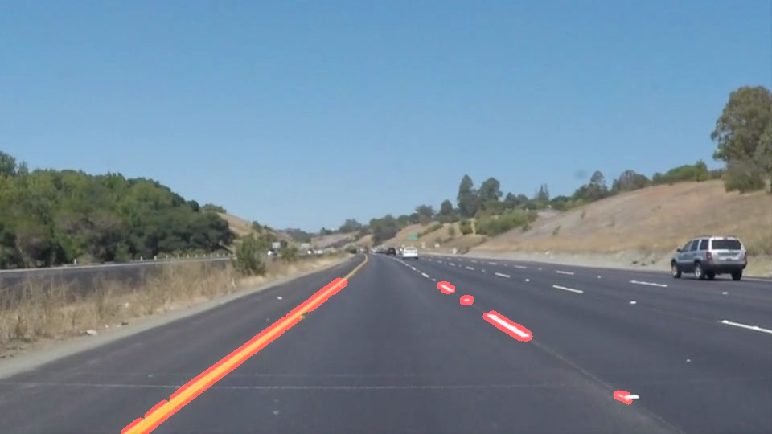
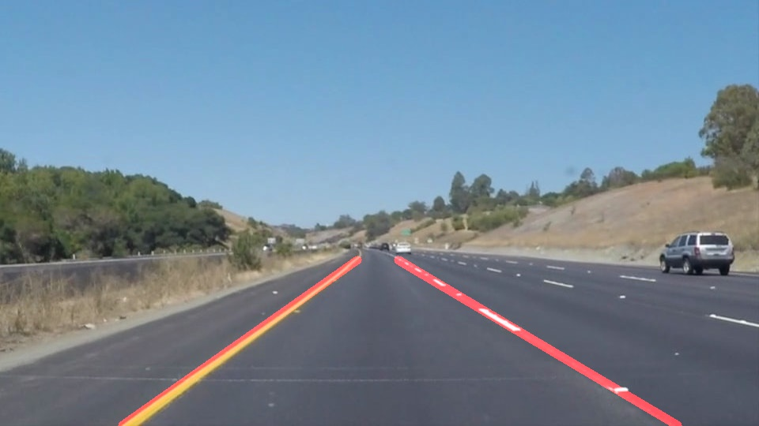

# Finding Lane Lines on the Road

### 0. List of files
* P1.ipynb: program of ipython notebook
* P1.html: html file converted from ipython notebook file.
* ./test_images/out_*.jpg: results of lane detection
* ./test_images2/out_*.jpg: results of lane detection and extrapolation
* [Video: Finding Lane Lines -solidWhiteRight](https://youtu.be/qAFvPQWzjSU): detection results of videos (solidWhiteRight)
* [Video: Finding Lane Lines -solidWhiteRight2](https://youtu.be/cd4RMSEsFYk): detection results of videos (solidWhiteRight2)
* [Video: Finding Lane Lines -solidYellowLeft](https://youtu.be/7YAour8Fce4): detection results of videos (solidYellowLeft)
* [Finding Lane Lines -challenge](https://youtu.be/D9DkRYfTV-k): detection results of videos (challenge)

### 1. Describe your pipeline. As part of the description, explain how you modified the draw_lines() function.
My pipeline consisted of 6 steps. 
1. Converting images to grayscale
2. Applying a Gaussian Noise kernel
3. Canny transformation
4. Applying an image mask
5. Hough Transformation
6. overlaying lines and image

In order to draw a single line on the left and right lanes, I modified the draw_lines() function by averaging and extrapolating lines.

### 2. Identify potential shortcomings with your current pipeline
My LaneLine detection algorithm is not robust enough because it fluctuates in the movie.

### 3. Suggest possible improvements to your pipeline
A possible improvement would be to masking noises from detected lines.
Another possible improvement would be to tracking detected lines in a time series and averate them in a short time period.

