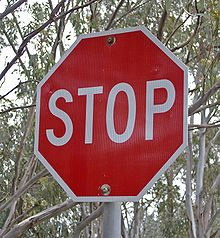

# Traffic Sign Classifier

## 0. List of files
* Traffic_Sign_Classifier.ipynb: program of ipython notebook
* report.html: html file converted from ipython notebook file.
* ./Download_German/*.jpg: additional images used for the project that are not from the German Traffic Sign Dataset.

## 1. Design and Test a Model Architecture.
### Preprocessing
The input data was normalized simply by subtracting 128 and by dividing by 128.

### Model Architecture
The model is a modified version of Lenet with 2 convolution layers, 2 pooling layers and 3 fully connected layers. The following things are different from the original one.
- conv1: Increased input channels from 1 to 3.
- conv2: Added dropout layer with dropout ratio=0.5
- FC1: Incleased number of hidden nodes from 120 to 400. Added dropout layer with dropout ratio=0.5
- FC2: Incleased number of hidden nodes from 84 to 400. Added dropout layer with dropout ratio=0.5
- FC3: Incleased output channels from 10 to 43.

### Model Training
The model was trained by minimizing cross entropy loss of 43 classes. The loss was optimized by Adam optimizer with learning rate = 0.001. Batch size is 128 and number of epochs is 50

### Solution Approach
The test accuracy was 96.1% which is above the base line of 93%. In order to achieve the good score, I incleased the number of hidden nodes of fully connected layers in order to fit the model to data sets with many classes well, and I used dropout in FC1 and FC2 in order to prevent over-fitting.

## 2. Test a Model on New Images
### Acquiring New Images
I picked up the following 5 images which were chosen by Google image search. These are corresponding to different five signs: Speed Limit 30kmh sign, Priority Road sign, Stop sign, Road Work sign and Turn right ahead sign. Especially the reason that I picked up a Speed Limit sign and a Road Work sign is that they contains complex imformation such as numeric characters and a figure of a working person so that the prediction scores of the 2 signs are expected to become worse than the other 3 signs.

### Performance on New Images
The prediction accuracity was 100% which means all of the prediction from the 5 images were correct. The score is larger than the test accuracy =96.1% of test data set.

### Model Certainty - Softmax Probabilities
All of the confidence score of the 5 predictions are above 97% which means that the model is faily confident on the predictions. The predictions from the first image (SpeedLimit) and fourth image (Road Work) is less confident because the confidence score of the secondary candidate is above 1%. The reason of the lower score is that the two traffic signs include more complex information than the other 3 signs.

