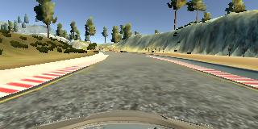
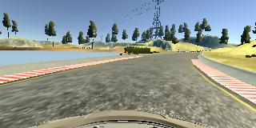
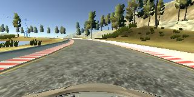
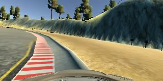
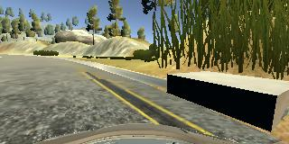
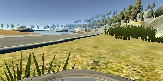
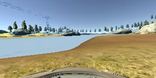
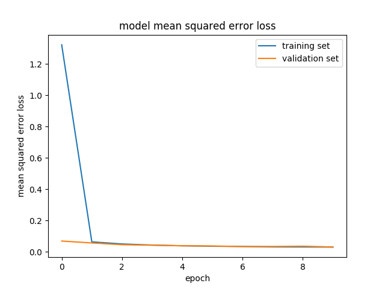

# 0. List of files
* model.py : program of ipython notebook
* drive.py : The script to drive the car (same as the original one).
* model.h5 : The saved model.
* [YouTube Video](https://youtu.be/xuOqP_Hzzgs) : A video recording of my vehicle driving autonomously at two laps around the track.

# 1. Preparing images from the simulator.
## Data of model driver
I prepared training data of model driver where the car drives at the center of the road.

## Data of corner cases
To make a trained network more robust, I also prepared data of corner cases.
For example, If the network is trained only by the model driver data where the car is located only at the center of the road, the the direction of the car is not modified if the car approaches to the edge of the road because such training data does not exists in the data of model driver case.
So I added to the training data such corner case data where the car is located around the edge of the road and outside the road.
I only used data with the steering angle larger than 0.01 bacause the data with steering angle =0 at road edge and out side the road is useless or even incorrect data.

## Using data from multiple cameras.
In order to train the network so that steering angle is directed to the center of the road, I also used data from left and right camera in addition to the center camera. 
Steering angles of the ground truth data of left and right cameras are calculated like this:
* steering_left = steering_center + 0.2
* steering_right = steering_center - 0.2

Data from center, left and right camera is selected randomly as data augumentation in the generator function for Keras fit_generator.

## Other data augumentations
The image data is randomly flipped horizontally in the generator function for Keras fit_generator.

## Validation dataset
Validation dataset was created by dividing the original data with 80%:20% ratio.

# 2. structure of network
My newral network comprises the following layers:
1. Normalization layer using Lambda
1. Cropping2D layer to cut unneeded area.
1. Convolution layer with 3x3 kernel, 16 output channels, valid padding and ReLU activation.
1. Convolution layer with 3x3 kernel, 16 output channels, valid padding and ReLU activation.
1. Max Pooling layer with 2x2 kernel
1. Dropout layer with dropout ratio = 0.25
1. Flatten layer
1. Fully Connected layer with 64 outputs (without activation <- this is my mistake)
1. Dropout layer with dropout ratio = 0.5
1. Fully Connected layer with 1 outputs without activation

Oops, It seems that I mistakenly forgot to implement ReLU activation in the first Fully Connected layer, so non-linearity of the two fully connected layers are not took advantage of fully by my unforced errors. However, as shown in [YouTube Video](https://youtu.be/xuOqP_Hzzgs), the above network looks working well to drive in the simulator even if the bug exists in my network.

# 3. training approach
The network was trained with the following conditions:
* Optimizer: Adam optimizer
* Number of epochs: 10 epochs

As shown in the learning curve below, no overfitting happended in the training procedure.

# 3. Simulation
[YouTube Video](https://youtu.be/xuOqP_Hzzgs) is a test result of the trained network.
The car is automatically drived properly at least 2 laps without any unsafe drivings.
