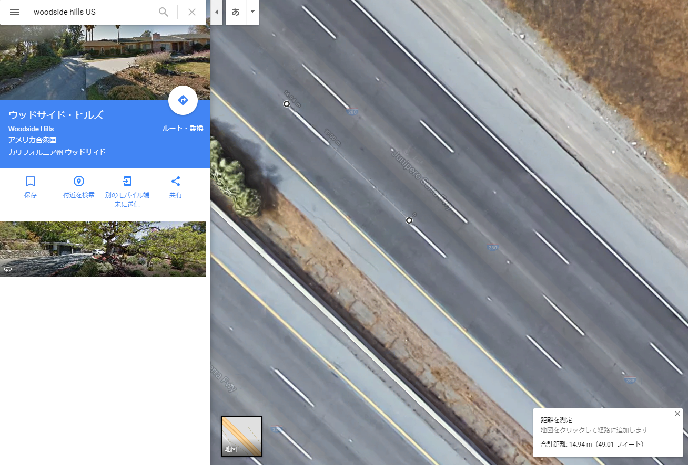
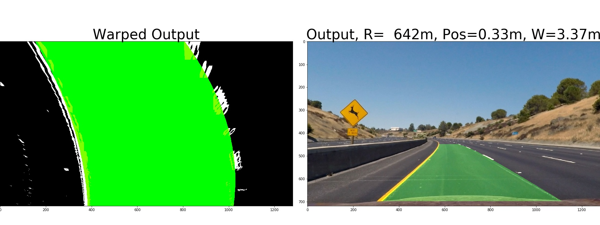

# 13. Advanced Lane Finding Project**

## 1. List of files
* AdvancedLaneLines.ipynb : program of ipython notebook
* calibration1.jpg : An example of undistorted calibration images.
* straight_lines1_undistortion.jpg : An example of undistorted road images.
* straight_lines1_combined_thresholds.jpg : An example of lane detection results using combined threshold.
* straight_lines1_perspective_transform.jpg : An example of perspective transformation of lane detection results.
* straight_lines*.jpg, test*.jpg: Examples of lane boundary detection results in both of car view and bird eye view, and estimation results of radius and car position.
* (YouTube Video)[https://youtu.be/d8P2C7rUuRU] : Video output of Lane Detection results

[//]: # (Image References)

[image1]: ./calibration1.jpg "Undistorted"
[image2]: ./straight_lines1_undistortion.jpg "Road Transformed"
[image3]: ./straight_lines1_combined_thresholds.jpg "Combined Thresholds"
[image4]: ./straight_lines1_perspective_transform.jpg "Bird Eye View"
[image5]: ./straight_lines1.jpg "Lane boundary detection results"

### Here I will consider the rubric points individually and describe how I addressed each point in my implementation.  

---

## 2. Camera Calibration

I start by preparing "object points", which will be the (x, y, z) coordinates of the chessboard corners in the world. Here I am assuming the chessboard is fixed on the (x, y) plane at z=0, such that the object points are the same for each calibration image.  Thus, `objp` is just a replicated array of coordinates, and `objpoints` will be appended with a copy of it every time I successfully detect all chessboard corners in a test image.  `imgpoints` will be appended with the (x, y) pixel position of each of the corners in the image plane with each successful chessboard detection.  

I then used the output `objpoints` and `imgpoints` to compute the camera calibration and distortion coefficients using the `cv2.calibrateCamera()` function.  I applied this distortion correction to the test image using the `cv2.undistort()` function and obtained this result: 

![alt text][image1]

## 3. Pipeline (single images)

### 3-1. Provide an example of a distortion-corrected image.

To demonstrate this step, I will describe how I apply the distortion correction to one of the test images like this one:
![alt text][image2]

### 3-2. Describe how (and identify where in your code) you used color transforms, gradients or other methods to create a thresholded binary image.  Provide an example of a binary image result.

I used a combination of color S channel threshold and x gradient thresholds to generate a binary image (thresholding steps at a function called 'ThresholdedBinary()' in `AdvancedLaneLines.ipynb`).  Here's an example of my output for this step.

![alt text][image3]

### 3-3. Describe how (and identify where in your code) you performed a perspective transform and provide an example of a transformed image.

The code for my perspective transform is implemented in the following quoted lines in the file `AdvancedLaneLines.ipynb`.  It takes as inputs an image of binary image (`_ThresBinary`), as well as source (`src`) and destination (`dst`) points.  I chose the hardcode the source and destination points in the following manner:

```python
offset = 0
_center = img_size[0]/2
_top_left     = [_center-85,450]
_top_right    = [_center+85,450]
_bottom_right = [_center+800, img_size[1]-20]
_bottom_left  = [_center-800, img_size[1]-20]
src = np.float32([ _top_left, _top_right, _bottom_right, _bottom_left])
dst = np.float32([[offset, offset], [img_size[0]-offset, offset], [img_size[0]-offset, img_size[1]-offset], [offset, img_size[1]-offset]])
_M = cv2.getPerspectiveTransform(src, dst)
_Minv = cv2.getPerspectiveTransform(dst, src)
_warped = cv2.warpPerspective(_ThresBinary, _M, img_size, flags=cv2.INTER_LINEAR)

# Plot the result
f, (ax1, ax2) = plt.subplots(1, 2, figsize=(24, 9))
f.tight_layout()
ax1.imshow(_ThresBinary, cmap='gray')
ax1.set_title('Original', fontsize=40)
#ax1.plot(_top_left[0],_top_left[1],'r+')
#ax1.plot(_top_right[0],_top_right[1],'r+')
#ax1.plot(_bottom_right[0],_bottom_right[1],'r+')
#ax1.plot(_bottom_left[0],_bottom_left[1],'r+')
ax1.plot([_top_left[0],_top_right[0]], [_top_left[1],_top_right[1]], color='r', lw=2)
ax1.plot([_top_left[0],_bottom_left[0]], [_top_left[1],_bottom_left[1]], color='r', lw=2)
ax1.plot([_bottom_right[0],_top_right[0]], [_bottom_right[1],_top_right[1]], color='r', lw=2)
ax1.plot([_bottom_right[0],_bottom_left[0]], [_bottom_right[1],_bottom_left[1]], color='r', lw=2)
#ax2.imshow(_result)
ax2.imshow(_warped, cmap='gray')
ax2.set_title('Warped', fontsize=40)
plt.subplots_adjust(left=0., right=1, top=0.9, bottom=0.)
plt.savefig("./output_images/straight_lines1_perspective_transform.jpg")
```

This resulted in the following source and destination points:

| Source        | Destination   | 
|:-------------:|:-------------:| 
| 555, 450      | 0, 0        | 
| 725, 450      | 1280, 0      |
| 1440, 700     | 1280, 720      |
| -160, 700      | 0, 720        |

I verified that my perspective transform was working as expected by drawing the `src` and `dst` points onto a test image and its warped counterpart to verify that the lines appear parallel in the warped image.

![alt text][image4]

### 3-4. Describe how (and identify where in your code) you identified lane-line pixels and fit their positions with a polynomial?

I identified lane-line pixels by sliding windows search using convolution. This is implemented in functions called 'find_window_centroids()' and 'DetectLaneLines() ' in the file `AdvancedLaneLines.ipynb`.

Then I fit my lane lines with a 2nd order polynomial in a function called 'PolyFitting()'. Here is an example of lane line fitting results (Left figure of the below. Areas between left fitted curve and right fitted curve are filled with green color.):

![alt text][image5]

### 3-5. Describe how (and identify where in your code) you calculated the radius of curvature of the lane and the position of the vehicle with respect to center.

I did this in a function called 'PolyFitting()' in my code in `AdvancedLaneLines.ipynb`
By using the information of Google Map below, I estimated cycle length of dashed line is about 15m length. Then I estimated _ym_per_pix = 15*2.7/720 because about 2.7 cycles of dashed line are included in the bird eye view (y width=720px). In addition, I assumed the lane width is about 3.7m length, and then I estimated _xm_per_pix = 3.7/700.



I estimated the position of vehicle from the center position of left and right curve at the bottom of the bird eye view..

For example, the estimated radius of test2.jpg was R=642m, and the estimated position of vehicle is pos=0.33m. The result looks reasonable.




#### 6. Provide an example image of your result plotted back down onto the road such that the lane area is identified clearly.

I implemented this step in a function called 'DetectLanes()' in my code in `AdvancedLaneLines.ipynb`.  Here is an example of my result on a test image:

![alt text][image5]

---

## Pipeline (video)

### 1. Provide a link to your final video output.  Your pipeline should perform reasonably well on the entire project video (wobbly lines are ok but no catastrophic failures that would cause the car to drive off the road!).

Here's a (YouTube Video)[https://youtu.be/d8P2C7rUuRU]

---

## Discussion

### 1. Briefly discuss any problems / issues you faced in your implementation of this project.  Where will your pipeline likely fail?  What could you do to make it more robust?

In order to make my detection algorithm more robust, I implemented tracking in a class called 'DetectedLines()' in `AdvancedLaneLines.ipynb`. This works well in project_video.mp4. However, if I tried my algorithm on challenge_video.mp4 and harder_challenge_video.mp4, my algorithm didn't work well and detection result was not stable. These issues are supposed to be caused by the following problems:
* My combined threshold algorithm 'ThresholdedBinary()' is not tuned well, and it is not robust to different optical conditions.
* Because I fitted the lane line in a second order polynomial, my fitting doesn't work well when a shape of lane line is more complex.
