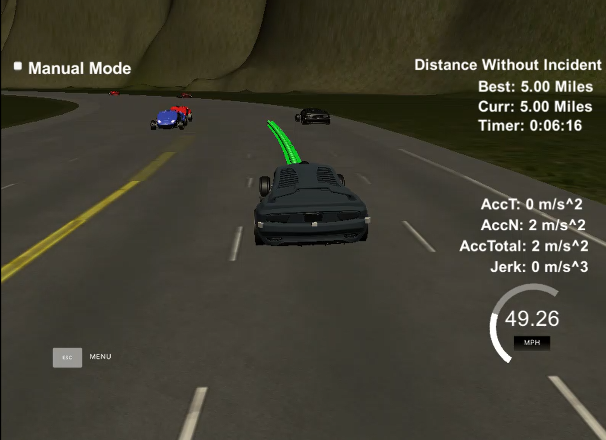
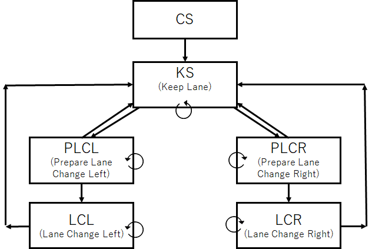

# 06. Project: Path Planning

## 1. Files and environments
### 1-1. List of files
* [src/\*.cpp, src/\*.h](./src/) : source codes of this project.
* [YouTube video](https://youtu.be/Kau029bPIyg): Screen shot video of simulator.
* [StateMachine](./StateMachineChart.png) : State Machine Chart of Finite State Machine

### 1-2. Environment
My code successfully compiled with cmake and make using default CMakeLists.txt in the following environments:
* OS: Windows10 and Ubuntu 16.4 bash on WSL of Windows 10 Fall Creators Update.
* cmake v3.5.1
* GNU Make v4.1
* gcc/g++ v5.4.0

[//]: # (Image References)
[StateMachine.png]: ./StateMachineChart.png
[ScreenCapture.png]: ./ScreenCapture.png

---
## 2. Writeup / README

### 2-1. Compilation
#### 2-1-1. CRITERIA: The code compiles correctly.
My code was successfully compiled without errors.

---
### 2-2. Valid Trajectories
#### 2-2-1. CRITERIA: The car is able to drive at least 4.32 miles without incident.
As shown in [YouTube video](https://youtu.be/Kau029bPIyg), the car drove more than 5 miles without incident.
  

#### 2-2-2. CRITERIA: The car drives according to the speed limit.
The velocity of the car was limited under 49.5 miles/hour. When the car was not obstructed by traffic, the velocity was kept as fast as possible under the speed limit. Even when the car was obstructed by traffic, the velocity was kept around the velocity of the obstacle.

#### 2-2-3. CRITERIA: Max Acceleration and Jerk are not Exceeded.
The car didn't exceed a total acceleration of 10m/s^2 and a jerk of 10m/s^3.

#### 2-2-4. CRITERIA: Car does not have collisions.
The car didn't have any collisions.

#### 2-2-5. CRITERIA: The car stays in its lane, except for the time between changing lanes.
The car stayed in its lane inside one of the 3 lanes on the right hand side of the road except for lane changes. When the car changed its lane, the car didn't spend more than a 3 second length out side the lane lanes.

#### 2-2-6. CRITERIA: The car is able to change lanes
The car was able to smoothly change lanes when the car was behind a slower traffic and an adjacent lane was clear of other traffic.
If the center lane of the 3 lanes was clear of the traffic, the car stayed at the center lane as much as it could because there was more degree of freedom of lane change maneuvers at the center lane than the others.

---
### 2-3. Reflection
#### 2-3-1. CRITERIA: There is a reflection on how to generate paths.
Here is a state machine chart of my finite state machine model.
  
This state machine was defined at `getSuccessorStates()` in `main.cpp`.
The costs of its state transitions were difined at `calculateCost()` in `main.cpp` so that the vehicle can select the best maneuver with the smallest cost at `planBehavior()` in `main.cpp`. In the cost model, both of feasibility (do not enter out of the road), safety(do not collide with other vehicles) and comfort (do not change lanes too much) are being considered. The trajectory of the car is calculated at `getTrajectory()` in `main.cpp` for each maneuver. The trajectory was calculated by spline with using the target lane (`destination_lane`) and reference velocity (`ref_velocity_MPH`), 

